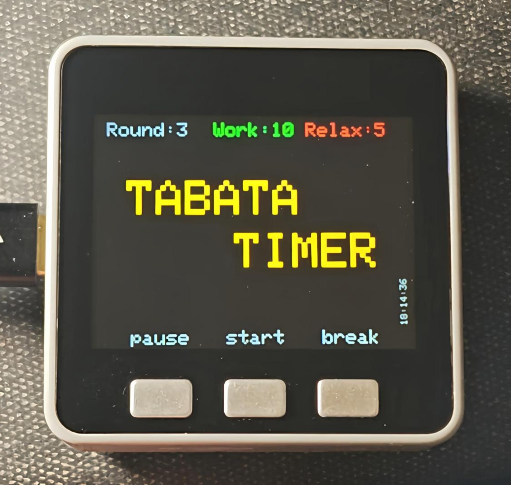

# Tabata Timer

Простой и удобный таймер для интервальных тренировок по методу Табата, реализованный на платформе M5Stack Grey.

  

 

  

## Описание

Это приложение позволяет проводить высокоинтенсивные интервальные тренировки (HIIT) по протоколу Табата:
- **20 секунд** интенсивной работы;
- **10 секунд** отдыха;
- **8 циклов** (1 раунд = 4 минуты);
- настраиваемое количество раундов и времени.

## Функциональные возможности

- Запуск/остановка таймера кнопками.
- Визуальный отсчёт времени на экране (крупные цифры) и цветовая индикация.
- Звуковое оповещение в начале/конце интервала.
- Отображение текущего раунда и цикла.

## Установка

1. Установите **Visual Studio Code**.
2. В VS Code установите расширение **PlatformIO IDE**.

## Использование

1. После запуска на экране появится стартовый экран.
2. Нажмите «start» для начала тренировки.
3. Во время тренировки:
   - Красный фон — фаза отдыха (10 сек).
   - Зелёный фон — фаза тренировки (20 сек).
   - Звуковой сигнал отмечает начало/конец интервала.
4. Для паузы нажмите «pause», для сброса — «break».
5. Вкл и выкл звука проиходит при нажатии на «break».

## Источник

- GitHub: https://github.com/gicod/m5stack_tabata

# Высокоинтенсивные интервальные тренировки (HIIT) по протоколу Табата

## 1. Суть метода

Протокол Табата — это разновидность HIIT (высокоинтенсивных интервальных тренировок), разработанная японским доктором Идзуми Табата. Суть метода — **максимальная нагрузка за минимальное время**.

Эффективность 4‑минутной табата‑тренировки сопоставима с 60 минутами стандартного кардио.

Во время тренировки организм переходит в **анаэробный режим** (без участия кислорода), что способствует:
- жиросжиганию (в том числе после тренировки);
- развитию выносливости;
- укреплению и росту мышц.

## 2. Структура тренировки

Табата‑тренировка строится по чёткой схеме:
- **Цикл:** 20 секунд максимальной нагрузки + 10 секунд отдыха.
- **Табата‑раунд (серия циклов):** 6–8 повторений цикла (длится 3–4 минуты).
- **Отдых между раундами:** 1–2 минуты.
- **Количество раундов:** 3–5 (общая продолжительность — 15–25 минут).

## 3. Рекомендуемые упражнения

Используются:
- плиометрические упражнения (например, прыжки с разведением рук и ног — *Jumping Jack*);
- силовые упражнения с весом собственного тела (отжимания, приседания, берпи);
- упражнения с лёгким весом.

## 4. Частота тренировок

- **Для похудения:** 3–4 раза в неделю по 15–30 минут или 2–3 раза в неделю по 40–45 минут.
- **Для поддержания формы / совмещения с силовыми тренировками:** 2 раза в неделю по 15–30 минут.

## 5. Важные рекомендации

- **Не заниматься ежедневно** — это может привести к перетренированности и истощению ЦНС.
- **Выполнять табата‑упражнения после силовой нагрузки** (если тренировки проходят в один день).
- **Менять набор упражнений** — не повторять одну и ту же программу более 3 раз подряд (организм адаптируется, эффективность снижается).
- **Ориентироваться на свои биоритмы** — время тренировки (утро/вечер) не влияет на жиросжигание.
- **Избегать тренировок натощак и перед сном.**

## 6. Кому подходит?

Табата‑тренировки рекомендованы людям:
- со средним и высоким уровнем физической подготовки;
- желающим быстро похудеть и улучшить физическую форму;
- стремящимся развить выносливость;
- испытывающим застой в тренировках (в том числе для ускорения роста мышц).

## 7. Противопоказания

Табата **не подходит** людям:
- без опыта тренировок;
- с заболеваниями сердечно‑сосудистой системы (гипертония, атеросклероз);
- с проблемами опорно‑двигательного аппарата и суставов;
- недавно перенёсшим травмы (разрывы связок, сухожилий, переломы);
- придерживающимся низкоуглеводной или монодиеты;
- с нарушениями работы пищеварительной системы;
- с низкой выносливостью;
- беременным.

## 8. Ключевые принципы

- **Индивидуальность:** нагрузка должна соответствовать возможностям без ущерба для здоровья.
- **Систематичность:** непрерывность тренировочного процесса с рациональным чередованием нагрузок и отдыха.
- **Постепенность:** повышение нагрузки с учётом индивидуальных возможностей.

## Вывод

Табата‑тренировки — эффективный способ улучшить физическую форму за короткое время, но требуют серьёзной подготовки и соблюдения мер предосторожности.

**Перед началом тренировок рекомендуется проконсультироваться с врачом.**
